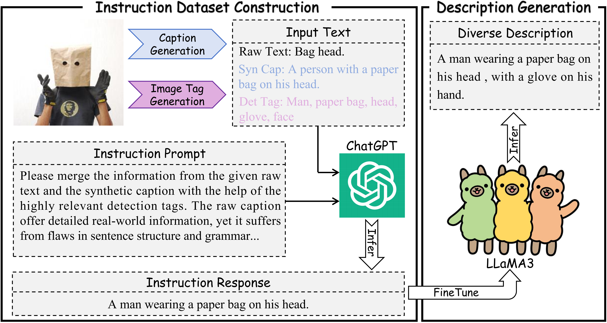

# [EMNLP 2024] RWKV-CLIP: A Robust Vision-Language Representation Learner


> **[RWKV-CLIP: A Robust Vision-Language Representation Learner](https://arxiv.org/abs/2406.06973)** <br>
<a href="https://github.com/GaryGuTC">Tiancheng Gu</a>,</span>
<a href="https://kaicheng-yang0828.github.io">Kaicheng Yang</a>,</span>
<a href="https://github.com/anxiangsir">Xiang An</a>,</span>
Ziyong Feng,</span>
<a href="https://scholar.google.com/citations?user=JZzb8XUAAAAJ&hl=zh-CN">Dongnan Liu</a>,</span>
<a href="https://weidong-tom-cai.github.io/">Weidong Cai</a>,</span>
<a href="https://jiankangdeng.github.io">Jiankang Deng</a></span>

## 📣 News
- [2024/10/14]:✨The training data [YFCC15M](https://huggingface.co/datasets/Kaichengalex/YFCC15M) has been released in 🤗Hugging Face.
- [2024/09/20]:🎉RWKV-CLIP has been aeecpted by EMNLP2024(Main)
- [2024/06/25]:✨The training code and pertrained weight of RWKV-CLIP have been released.
- [2024/06/11]:✨The paper of [RWKV-CLIP](https://arxiv.org/abs/2406.06973) is submitted to arXiv.
## 💡 Highlights
We introduce a diverse description generation framework that can leverage Large Language Models(LLMs) to synthesize and refine content from web-based texts, synthetic captions, and detection tags. Beneficial form detection tags, more semantic information can be introduced from images, which in turn further constrains LLMs and mitigates hallucinations.



We propose RWKV-CLIP, the first RWKV-driven vision-language representation learning model that combines the effective parallel training of transformers with the efficient inference of RNNs.


## 🎨 In-Progress
- [x] Release training code
- [x] Release pretrain model weight
- [x] Release 70k Instruction Dataset
- [x] Release the generated diverse descriptions of [YFCC15M](https://huggingface.co/datasets/Kaichengalex/YFCC15M)


## Environment installation
```bash
conda create -n rwkv_clip python=3.10 -y
conda activate rwkv_clip

pip install torch==2.1.2 torchvision==0.16.2 torchaudio==2.1.2 --index-url https://download.pytorch.org/whl/cu118
pip install -U openmim
mim install mmcv-full==1.7.2
pip install -r requirements.txt
```

## Usage
```bash
git clone https://github.com/deepglint/RWKV-CLIP.git
cd RWKV-CLIP
```

```python
import os
import clip
import json
import torch
import warnings
from PIL import Image
from torch.nn import functional as F
from open_clip.transform import image_transform
from model_config.utils_notebook import load_model_configs
warnings.filterwarnings('ignore')
args = load_model_configs('model_config/RWKV_CLIP_B32.json') # model_config/RWKV_CLIP_B16.json
from model.utils import create_RWKV_Model

transform = image_transform(args.input_size, False)
device = "cuda" if torch.cuda.is_available() else "cpu"

# Transfer to input type
image = transform(Image.open("figure/Diverse_description_generation_00.png")).unsqueeze(0).to(device) 
text = clip.tokenize(["a diagram", "a dog", "a cat"]).to(device)

# Load model
RWKV_CLIP_model = create_RWKV_Model(args, model_weight_path = "Model_pretrained_weight.pt").to(device)
RWKV_CLIP_model.eval()

# Calculate score
with torch.no_grad():
    image_features, text_features, logit_scale = RWKV_CLIP_model(image, text)
    image_features /= image_features.norm(dim=-1, keepdim=True)
    text_features /= text_features.norm(dim=-1, keepdim=True)
    text_probs = (100.0 * image_features @ text_features.T).softmax(dim=-1)
print("Label probs: ", text_probs.tolist()) # Label probs: [[1., 0., 0.]]
```

## Instruction Dataset
- The 70K instruction dataset used to finetune LLaMA3 can be download from the [Google Drive](https://drive.google.com/file/d/1C5mAECH2rDnZfcOQmJpBXpfbhgEcm2C1/view?usp=drive_link) or [BaiduYun](https://pan.baidu.com/s/1xwGY_i-ADBd26pom9yENzA?pwd=zby2)

## Download YFCC15M
- The YFCC15M dataset we used is [YFCC15M-DeCLIP](https://arxiv.org/abs/2110.05208), we download it from the [repo](https://github.com/AdamRain/YFCC15M_downloader), finally we successful donwload 15061515 image-text pairs.

- The YFCC15M dataset we used to train RWKV-CLIP has been released in [Hugging Face](https://huggingface.co/datasets/Kaichengalex/YFCC15M).

## Generate rec files
- To improve the training efficience, we use [MXNet](https://github.com/apache/mxnet) to save the YFCC15M dataset to rec file, and use NVIDIA [DALI](https://github.com/NVIDIA/DALI) to accelerate data loading and pre-processing. The sample code to generate rec files is in [data2rec.py](data2rec.py).

## Pretrained Model Weights

|  Model   |   Dataset   |      Download       |
|:--------:|:--------:| ------:|
| RWKV-CLIP-B/32  |    YFCC15M   |   🤗[ckpt](https://huggingface.co/Kaichengalex/RWKV-CLIP-B32-YFCC15M/resolve/main/model_31.pt)    \| [cfg](model_config/RWKV_CLIP_B32.json)        |
| RWKV-CLIP-B/32  |    LAION10M   |   🤗[ckpt](https://huggingface.co/Kaichengalex/RWKV-CLIP-B32-LAION10M/rsolve/main/model_31.pt)    \| [cfg](model_config/RWKV_CLIP_B32.json)       |
| RWKV-CLIP-B/16  |    LAION10M   |  🤗[ckpt](https://huggingface.co/Kaichengalex/RWKV-CLIP-B16-LAION10M/resolve/main/model_31.pt) \| [cfg](model_config/RWKV_CLIP_B16.json) |
| RWKV-CLIP-B/32  |    LAION30M   |  🤗[ckpt](https://huggingface.co/Kaichengalex/RWKV-CLIP-B32-LAION30M/resolve/main/model_31.pt)    \| [cfg](model_config/RWKV_CLIP_B32.json)        |

- You can download the pretrained model weight of RWKV-CLIP-B/32 on YFCC15M from [Google Drive](https://drive.google.com/file/d/1OnYoYt5oBZukv0jJ94wO_Uv5QUojHDk-/view?usp=drive_link) or [BaiduYun](https://pan.baidu.com/s/1PTwT84wSTMYt-M6sEu4IGQ?pwd=mfvh)

## Training

    bash shell/train_RWKV_CLIP_B32_YFCC15M.sh

## Evaluation
Evaluate zero shot cross-modal retireval

    bash shell/test_zero_shot_retrieval.sh

Evaluate zero shot classification

    bash shell/test_zero_shot_classificaiton.sh

## Results
- ### zero shot cross modal retrieval 
    <table><tbody>
    <!-- START TABLE -->
    <!-- TABLE HEADER -->
    <th valign="center">Method</th>
    <th valign="center">Model</th>
    <th valign="center">MSCOCO R@1</th>
    <th valign="center">MSCOCO R@5 </th>
    <th valign="center">MSCOCO R@10 </th>
    <th valign="center">Flickr30k R@1</th>
    <th valign="center">Flickr30k R@5</th>
    <th valign="center">Flickr30k R@10</th>
    <!-- TABLE BODY -->
    <tr>
    <td align="center">CLIP</td>
    <td align="center">B/32</td>
    <td align="center">20.8/13.0</td>
    <td align="center">43.9/31.7</td>
    <td align="center">55.7/42.7</td>
    <td align="center">34.9/23.4</td>
    <td align="center">63.9/47.2</td>
    <td align="center">75.9/58.9</td>
    </tr>
    <tr>
    <td align="center">SLIP</td>
    <td align="center">B/32</td>
    <td align="center">27.7/18.2</td>
    <td align="center">52.6/39.2</td>
    <td align="center">63.9/51.0</td>
    <td align="center">47.8/32.3</td>
    <td align="center">76.5/58.7</td>
    <td align="center">85.9/68.8</td>
    </tr>
    <tr>
    <td align="center">DeCLIP</td>
    <td align="center">B/32</td>
    <td align="center">28.3/18.4</td>
    <td align="center">53.2/39.6</td>
    <td align="center">64.5/51.4</td>
    <td align="center">51.4/34.3</td>
    <td align="center">80.2/60.3</td>
    <td align="center">88.9/70.7</td>
    </tr>
    <tr>
    <td align="center">UniCLIP</td>
    <td align="center">B32</td>
    <td align="center">32.0/20.2</td>
    <td align="center">57.7/43.2</td>
    <td align="center">69.2/54.4</td>
    <td align="center">52.3/34.8</td>
    <td align="center">81.6/62.0</td>
    <td align="center">89.0/72.0</td>
    </tr>
    <tr>
    <td align="center">HiCLIP</td>
    <td align="center">B/32</td>
    <td align="center">34.2/20.6</td>
    <td align="center">60.3/43.8</td>
    <td align="center">70.9/55.3</td>
    <td align="center">——</td>
    <td align="center">——</td>
    <td align="center">——</td>
    </tr>
    <tr>
    <td align="center">ALIP</td>
    <td align="center">B/32</td>
    <td align="center">46.8/29.3</td>
    <td align="center">72.4/54.4</td>
    <td align="center">81.8/65.4</td>
    <td align="center">70.5/48.9</td>
    <td align="center">91.9/75.1</td>
    <td align="center">95.7/82.9</td>
    </tr>
    <tr>
    <td align="center"><b>Ours</b></td>
    <td align="center"><b>B/32</b></td>
    <td align="center"><b>50.3/34.0</b></td>
    <td align="center"><b>76.2/60.9</b></td>
    <td align="center"><b>85.2/71.7</b></td>
    <td align="center"><b>76.0/57.6</b></td>
    <td align="center"><b>94.7/82.3</b></td>
    <td align="center"><b>97.6/88.7</b></td>
    </tr>
    </tbody></table>


- ### zero shot classification 
    <table><tbody>
    <!-- START TABLE -->
    <!-- TABLE HEADER -->
    <th valign="center">Method</th>
    <th valign="center">Model</th>
    <th valign="center">CIFAR10</th>
    <th valign="center">CIFAR100</th>
    <th valign="center">Food101</th>
    <th valign="center">Pets</th>
    <th valign="center">Flowers</th>
    <th valign="center">SUN397</th>
    <th valign="center">Cars</th>
    <th valign="center">DTD</th>
    <th valign="center">Caltech101</th>
    <th valign="center">Aircraft</th>
    <th valign="center">Imagenet</th>
    <th valign="center">Average</th>

    <!-- TABLE BODY -->
    <tr>
    <td align="center">CLIP</td>
    <td align="center">B/32</td>
    <td align="center">63.7</td>
    <td align="center">33.2</td>
    <td align="center">34.6</td>
    <td align="center">20.1</td>
    <td align="center">50.1</td>
    <td align="center">35.7</td>
    <td align="center">2.6</td>
    <td align="center">15.5</td>
    <td align="center">59.9</td>
    <td align="center">1.2</td>
    <td align="center">32.8</td>
    <td align="center">31.8</td>
    </tr>
    <tr>
    <td align="center">SLIP</td>
    <td align="center">B/32</td>
    <td align="center">50.7</td>
    <td align="center">25.5</td>
    <td align="center">33.3</td>
    <td align="center">23.5</td>
    <td align="center">49.0</td>
    <td align="center">34.7</td>
    <td align="center">2.8</td>
    <td align="center">14.4</td>
    <td align="center">59.9</td>
    <td align="center">1.7</td>
    <td align="center">34.3</td>
    <td align="center">30.0</td>
    </tr>
    <tr>
    <td align="center">FILIP</td>
    <td align="center">B/32</td>
    <td align="center">65.5</td>
    <td align="center">33.5</td>
    <td align="center">43.1</td>
    <td align="center">24.1</td>
    <td align="center">52.7</td>
    <td align="center">50.7</td>
    <td align="center">3.3</td>
    <td align="center">24.3</td>
    <td align="center">68.8</td>
    <td align="center">3.2</td>
    <td align="center">39.5</td>
    <td align="center">37.2</td>
    </tr>
    <tr>
    <td align="center">DeCLIP</td>
    <td align="center">B/32</td>
    <td align="center">66.7</td>
    <td align="center">38.7</td>
    <td align="center">52.5</td>
    <td align="center">33.8</td>
    <td align="center">60.8</td>
    <td align="center">50.3</td>
    <td align="center">3.8</td>
    <td align="center">27.7</td>
    <td align="center">74.7</td>
    <td align="center">2.1</td>
    <td align="center">43.2</td>
    <td align="center">41.3</td>
    </tr>
    <tr>
    <td align="center">HiCLIP</td>
    <td align="center">B/32</td>
    <td align="center">74.1</td>
    <td align="center">46.0</td>
    <td align="center">51.2</td>
    <td align="center">37.8</td>
    <td align="center">60.9</td>
    <td align="center">50.6</td>
    <td align="center">4.5</td>
    <td align="center">23.1</td>
    <td align="center">67.4</td>
    <td align="center">3.6</td>
    <td align="center">40.5</td>
    <td align="center">41.8</td>
    </tr>
    <tr>
    <td align="center">ALIP</td>
    <td align="center">B/32</td>
    <td align="center">83.8</td>
    <td align="center">51.9</td>
    <td align="center">45.4</td>
    <td align="center">30.7</td>
    <td align="center">54.8</td>
    <td align="center">47.8</td>
    <td align="center">3.4</td>
    <td align="center">23.2</td>
    <td align="center">74.1</td>
    <td align="center">2.7</td>
    <td align="center">40.3</td>
    <td align="center">41.7</td>
    </tr>
    <tr>
    <td align="center"><b>Ours</b></td>
    <td align="center"><b>B/32</b></td>
    <td align="center"><b>79.8</b></td>
    <td align="center"><b>55.1</b></td>
    <td align="center"><b>50.6</b></td>
    <td align="center"><b>37.6</b></td>
    <td align="center"><b>57.1</b></td>
    <td align="center"><b>54.0</b></td>
    <td align="center"><b>4.1</b></td>
    <td align="center"><b>24.6</b></td>
    <td align="center"><b>77.1</b></td>
    <td align="center"><b>4.0</b></td>
    <td align="center"><b>44.3</b></td>
    <td align="center"><b>44.4</b></td>
    </tbody></table>


## Acknowledgements
This project is based on [RWKV](https://github.com/BlinkDL/RWKV-LM), [VisionRWKV](https://github.com/OpenGVLab/Vision-RWKV), [RAM++](https://github.com/xinyu1205/recognize-anything), [LLaMA-Factory](https://github.com/hiyouga/LLaMA-Factory), [vllm](https://github.com/vllm-project/vllm), [OFA](https://github.com/OFA-Sys/OFA), and [open_clip](https://github.com/mlfoundations/open_clip), thanks for their works.

## License

This project is released under the MIT license. Please see the [LICENSE](LICENSE) file for more information.

## Dataset Contributors
This project would not have been possible without the invaluable contributions of the following individuals, who have been instrumental in data scraping and collection:  
Thank you to all the contributors for their hard work and dedication!

| Contributor      | Emial    |
|------------------|----------|
| **Bin Qin**         | skyqin@gmail.com              |
| **Lan Wu**          | bah-wl@hotmail.com            |
| **Haiqiang Jiang**  | haiqiangjiang@deepglint.com   |
| **Yuling Wu**       | yulingwu@deepglint.com        |


## 📖 Citation
If you find this repository useful, please use the following BibTeX entry for citation.
```latex
@misc{gu2024rwkvclip,
      title={RWKV-CLIP: A Robust Vision-Language Representation Learner}, 
      author={Tiancheng Gu and Kaicheng Yang and Xiang An and Ziyong Feng and Dongnan Liu and Weidong Cai and Jiankang Deng},
      year={2024},
      eprint={2406.06973},
      archivePrefix={arXiv},
      primaryClass={cs.CV}
}
```

## 🌟Star History

[](https://star-history.com/#deepglint/RWKV-CLIP&Date)